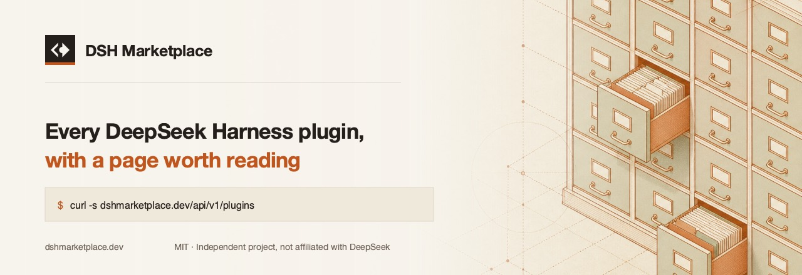

<p align="center">
  
</p>

<p align="center">
  <a href="https://dshmarketplace.dev"></a>
  <a href="https://github.com/DshMarketPlace/dshmarketplace/actions/workflows/deploy.yml"></a>
  <a href="#the-catalogue"></a>
  <a href="#public-api"></a>
  <a href="LICENSE"></a>
  <a href="https://linux.do"></a>
</p>

<p align="center">
  <b>English</b> · <a href="README.zh-CN.md">简体中文</a>
</p>

---

A bilingual directory of **DeepSeek Harness (DSH) plugins**. English at `/`,
Chinese at `/zh`, one catalogue behind both.

Live at **<https://dshmarketplace.dev>**.

## Why this exists

[DeepSeek Harness](https://github.com/deepseek-ai/deepseek-harness) is
DeepSeek's open agent harness, where every capability is a plugin. The
ecosystem passed a thousand plugins within weeks of launch.

Several directories index them already. Nearly all are card walls: repository
name, star count, a link straight out to GitHub. That is a table of contents,
not a reference — you still have to read the source to learn what a plugin
touches.

So the differentiator here is **written depth**. A promoted plugin gets its own
page carrying an overview, a documentation section and an illustration, in both
languages. That is slow to produce and cannot be scraped, which is the point.

This is deliberately early. **60 of 3,422 listings have that page today.** The
rest carry metadata, a verdict from a real install, and a summary while the
writing catches up. Nothing is padded with generated filler to make the number
look better.

## The catalogue

| | |
| --- | --- |
| Listings | **3,422** — 3,417 not archived |
| Categories | 14, from Memory and Vision to Themes |
| Installed and checked | **2,426** — each in its own throwaway container |
| AI reviews | 2,264, bilingual |
| Chinese summaries | 1,005 hand-written; the rest are still English-only |
| Written detail pages | 60, bilingual · 57 illustrated |
| LINUX DO verified | 7 |
| Verified presets | 3 sets, installed together before publishing |

### Presets, and why they are a separate claim

Three curated sets at [`/presets`](https://dshmarketplace.dev/presets), each
installable with `npx dshmarketplace-cli preset <id>`.

A listing's verdict comes from installing *that plugin* into an empty profile.
A preset says its members work **together**, which fails in ways the parts do
not — incompatible peers, a build script blocked only once another plugin drags
in its owner, and cordis rejecting a duplicate loader entry id so a plugin
installs, reports success and is never registered. So each set is run through
the sandbox as one install of the whole list, every member has to appear in the
profile's bundles, and the date, verdict and `dsh`/`pnpm` versions of that run
are published with it. A set that quietly drops a member is worse than no set.

Building your own: add plugins from any card on the site and the bar composes a
single command. `GET /api/v1/presets` serves the sets as JSON.

**Installed and checked** is the one column no competitor can scrape: it is the
record of a run, not of a repo. Verdicts are `passed` 2,043,
`needs-approval` 311, `not-a-layer` 43, `failed` 28, `timeout` 1 — and only the
last two are defects. See [Safety](#safety) for what that does and does not
prove.

**Verified** means the author posted the plugin on
[LINUX DO](https://linux.do) under their own name and answers for it in public.
It is a provenance signal, not a security review.

## Three surfaces, one source

Every surface reads the same API, so a listing cannot say one thing in a
browser and something else inside the harness.

| | |
| --- | --- |
| **Web** | <https://dshmarketplace.dev> |
| **CLI** | [`dshmarketplace-cli`](https://github.com/DshMarketPlace/dshmarketplace-cli) — for coding agents outside DSH |
| **Python** | [`dshmarketplace`](https://github.com/DshMarketPlace/dshmarketplace-py) — zero dependencies, `dshm` CLI, agent tools |
| **In DSH** | [`dshmarketplace-plugin`](https://github.com/DshMarketPlace/dsh-plugins-store) — `/store` inside the harness |
| **In the browser** | [DSH Plugin Radar](https://github.com/DshMarketPlace/dsh-plugin-radar) — a userscript that marks plugins on GitHub and npm |

## Public API

No key, no registration, CORS open.

```bash
curl -s 'https://dshmarketplace.dev/api/v1/plugins?q=memory&limit=5'
```

| Parameter | |
| --- | --- |
| `q` | Free-text search across name, summary and description |
| `category` | One of the 14 category ids |
| `limit` | 1–100, default 20 |
| `page` | 1-based |

Each result carries both summaries, the resolved install command, the risk
flags and the source repository:

```jsonc
{
  "fullName": "Anionex/dsh-vision-toolkit",
  "summary": "…",
  "summaryZh": "…",
  "stars": 128,
  "npmPackage": "dsh-vision-toolkit",
  "install": "dsh plugin --profile web add dsh-vision-toolkit",
  "installable": true,
  "riskFlags": ["install script"],
  "repoUrl": "https://github.com/Anionex/dsh-vision-toolkit",
  "url": "https://dshmarketplace.dev/plugins/anionex-dsh-vision-toolkit"
}
```

`install` is `null` rather than a placeholder when no command can work. A
caller that runs whatever is in that field must never be handed something that
fails — see the note on `--profile` below.

### The whole catalogue in one request

```bash
curl -s 'https://dshmarketplace.dev/api/v1/index'
```

For clients that need to know *which* of a thousand repositories are plugins —
a browser extension decorating a GitHub topic page cannot ask one at a time.
Rows are positional to keep it small, about 113 KB and 22 KB over the wire, and
the column names ship with the payload:

```jsonc
{
  "fields": ["fullName", "category", "install", "path", "npm"],
  "plugins": [
    ["Anionex/dsh-vision-toolkit", "vision", "dsh plugin --profile web add dsh-vision-toolkit", "/plugins/anionex-dsh-vision-toolkit", "dsh-vision-toolkit"]
  ]
}
```

`path` is `null` when a listing has no page of its own yet, and `npm` is `null`
when the plugin publishes nowhere.

## Two things about installing DSH plugins

Both cost real time to find, and neither is this project's doing.

**`--profile` is mandatory.** `dsh plugin` forwards to pnpm inside a profile
directory, so `dsh plugin add x` exits with *required option '--profile
&lt;name&gt;' not specified* and installs nothing. Every command this catalogue
emits carries it.

**`github:owner/repo#subpath` fails, but `#path:` works.** The bare form is
read as a git ref — `Could not resolve <sub> to a commit` — which is why 54
monorepo plugins here still show no one-line install. That is an
understatement, not a limitation: pnpm splits the fragment on `::` and treats a
`path:` part as a subdirectory, so `github:owner/repo#path:sub` installs. We
confirmed it end to end before saying so, and those listings are being fixed.

## Running it

```bash
pnpm install
cp .dev.vars.example .dev.vars     # Turso credentials, at minimum
pnpm dev                           # localhost:3177
```

| | |
| --- | --- |
| `pnpm build` | Must pass before any push |
| `pnpm preview` | Build and run under workerd, as it deploys |
| `pnpm tsx scripts/sync-github.ts` | Refresh GitHub metadata |
| `pnpm tsx scripts/write-content.ts --limit 10 --images` | Generate detail pages |
| `pnpm tsx scripts/promote.ts --limit 10` | Move pages into the sitemap |

Content generation talks to an OpenAI-shaped gateway of your choosing —
`IMAGE_API_BASE` and `VELOKEY_*` in `.dev.vars`. Nothing in the Worker reads
those; they are author-time only.

Push to `main` deploys to Cloudflare Workers in about 80 seconds.

## Architecture

```
app/(en)/            English routes — root layout sets lang="en"
app/(zh)/zh/         Chinese routes — root layout sets lang="zh-Hans"
components/views/    The pages themselves, locale-parameterised, shared by both
lib/dict.ts          Every visible string, both languages
db/schema.ts         plugins, categories, plugin_stats, submissions
scripts/             Author-time jobs: seed, sync, write, promote
```

Next.js 16 on Cloudflare Workers via [OpenNext](https://opennext.js.org/),
Turso for storage, Tailwind for styling. `CLAUDE.md` holds the engineering
rules and `STATUS.md` the inventory and trap list; both are worth reading
before a substantial change.

Two constraints shape more of this codebase than anything else:

- **The Worker size ceiling.** Getting under it cost twenty dependencies and
  the entire auth middleware. Check the bundle before adding a package.
- **Markdown renders at author time, never at request time.** `marked` and
  `sanitize-html` must not reach the Worker; sync writes `*Html` columns.

## The Chinese is written, not translated

Two rules, applied to every string in `lib/dict.ts`:

Product and ecosystem nouns stay in English — DeepSeek Harness, DSH, topic,
npm, Star, commit, agent, token, API — as do all commands, file names and
config keys. Chinese developers search for these in English, and 线束 is a
homophone that poisons the query.

Everything else is written the way a Chinese developer writes.
「装之前先看一眼」, not「安装前请仔细阅读」. No 让您 / 轻松 / 强大 / 赋能.
Machine translation into `lib/dict.ts` is not accepted.

## Contributing

Missing plugin, wrong category, bad summary — <https://dshmarketplace.dev/submit>,
or open an issue. Submissions are reviewed by hand before they appear.

If you wrote the plugin and posted it on LINUX DO, include the thread and it
can carry the verified badge.

Working on the code? Read [CONTRIBUTING.md](CONTRIBUTING.md) first. The scripts
in `scripts/` write to a live catalogue that publishes install commands people
copy and verdicts under other people's names, so which ones are destructive and
what has to run before them is not guesswork. [ops/README.md](ops/README.md)
says what runs where and why one CI job deliberately holds no secrets.

## Safety

Plugins are third-party code running with your agent's permissions.
**Listing here is not a security review.** Risk flags — install script,
terminal surface, requires credentials — are detected automatically and shown
before any install command. Their absence proves nothing. The source repository
is always linked; read it first.

## Contact

- **Community** — [LINUX DO](https://linux.do)
- **Issues** — [GitHub Issues](https://github.com/DshMarketPlace/dshmarketplace/issues)

## Acknowledgements

- [**LINUX DO**](https://linux.do) — where the DSH ecosystem is actually
  discussed, and where this project is published and takes its feedback.
- [awesome-dsh-plugin](https://github.com/awesome-dsh-plugin/awesome-dsh-plugin)
  (CC0-1.0) — the seed the catalogue grew from.
- [9d8dev/directory](https://github.com/9d8dev/directory) (MIT) — the
  application scaffold this started from. See [NOTICE](NOTICE).

## License

MIT. Plugin metadata belongs to the respective repository owners under their
own licenses.

Independent project, not affiliated with DeepSeek. DeepSeek and DeepSeek
Harness are marks of their respective owners, used here only to describe what
these plugins are for.
